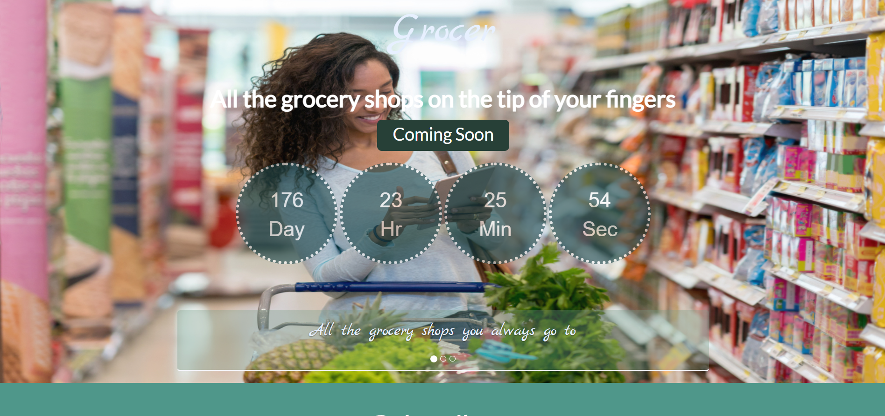

# Grocer

## Table of contents

- [Overview](#overview)
  - [The challenge](#the-challenge)
  - [Screenshot](#screenshot)
  - [Links](#links)
  - [Continued development](#continued-development)
- [Authors](#authors)

## Overview

### The challenge

Users should be able to:

- Order groceries online from the shops they love the most.
- Contact their personal shopper in order make changes to their shopping list on the fly.
- Get their in less than two hours from making the order.

### Screenshot

### Links

- [Live demo](https://gonzalo6282.github.io/grocer/)

### Continued development

We are still developing the website and mobile applications.

## Authors

- LinkedIn - [Gonzalo](https://www.linkedin.com/in/gonzpena/)

- LinkedIn - [Rodrigo](https://www.linkedin.com/in/rodrigo-pe%C3%B1a-359aa511/)

